**Elastic Container Service**

O Amazon Elastic Container Service (**ECS**) é um serviço de orquestração de contêineres.

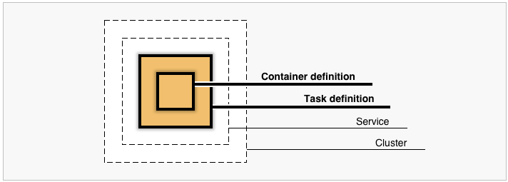

Camadas:

1.  Container - Onde fica a sua imagem (aplicação) imagem Docker

2.  Task - Parâmetros para a imagem rodar (memória, cpu e etc)

3.  Service - É onde fica a administração de instâncias

4.  Cluster - Agrupamento de instâncias (EC2 ou Fargate)

O serviço ECS pode ser criado com EC2 ou Fargate. Porém o serviço do Fargate é mais genérico e mais simples com o EC2 temos acesso as máquina que são criadas.

**Fargate**

AWS Fargate o "gerenciador" da infraestrutra que roda os containers. O Fargate decide quais maquinas a usar, tipo de servers e como escalar. No modelo **Fargate**, toda a infraestrutura é provisionada e gerenciada automaticamente pela AWS, diferentemente do modelo EC2.

Na criação do cluster pelo serviço do Fargate ele cria toda a parte de rede pra nós automaticamente que são conceitos que estão no VPC que são as faixas de rede nas quais a instancias estão associadas. Então ele cria tudo automaticamente como por exemplo o range da rede, as sub-redes, o security group que é onde estão as regras para permitir os tipos de acesso que queremos dar para as aplicações, por exemplo se criarmos o aplicação de exemplo do ECS com Fargate essa aplicação vai atender a porta 80 por que ele adiciona essa regra na criação.

**Parando o container**

No console Amazon se tentarmos para a Task ele nos dará uma mensagem de que o Service foi iniciado por um processo aotumatizado e que se quisermos parar é necessário atualizar (update) a Service, isso acontece por que quando criamos o ECS ele cria com o um número padrão de Taks's, 1 no caso, então se pararmos o serviço assim ele irpa se reiniciar na sequência, para mudar issso então entramos na parte de Service e atualizamos para 0 o número de Task's.

**Agora fazendo isso pelo CLI.**

[Instalar CLI AWS Linux](https://docs.aws.amazon.com/pt_br/cli/latest/userguide/install-cliv2-linux.html#cliv2-linux-prereq)

Após a instalação é necessário fazer a configuração através do comando: aws configure

Aqui será pedido os dados de **Access Key ID**, **Secret Access Key** e **region**; para os dados Access é necessário já ter a configuração de **user** e **security group**.

Para fazer por linha de comando com cli da **aws** é só usar o comando **update-service --service** e o nome do serviço **--desired-count 0** aqui é atualizado o número para zero igual fizemos no console na página da AWS aqui também podemos incrementar outros valores se quiséssemos aumentar o número de serviços.
```
aws update-service --service sample-app-service --desired-count 0
```
Outros comandos no aws cli:
```
aws ecs list-cluters //lista clusters

aws ecs list-services //lista serviços do cluster default

aws ecs list-services --cluster <nome-do-cluster> //lista os serviços do cluster com o nome que for passado

aws ecs list-tasks //lista tasks

aws ecs describe-cluters //info dos cluters mostrando as tarefas em execução
```
**Querys**

Buscando informações de todos os clusters:
```
aws ecs describe-clusters --query 'clusters[*].[clusterNmae,runningTasksCount]' //todos os clusters pegar o nome e as tasks rodando
```
Buscando todas as informações de uma task
```
aws ecs describe-tasks --cluster <nome-do-cluster> --tasks <id-task> --query 'tasks[*].{cpu:cpu,memoria:memory}'
```
**EC2 Criando ECS**

No console na página da AWS em Clusters clicar em Create Cluster

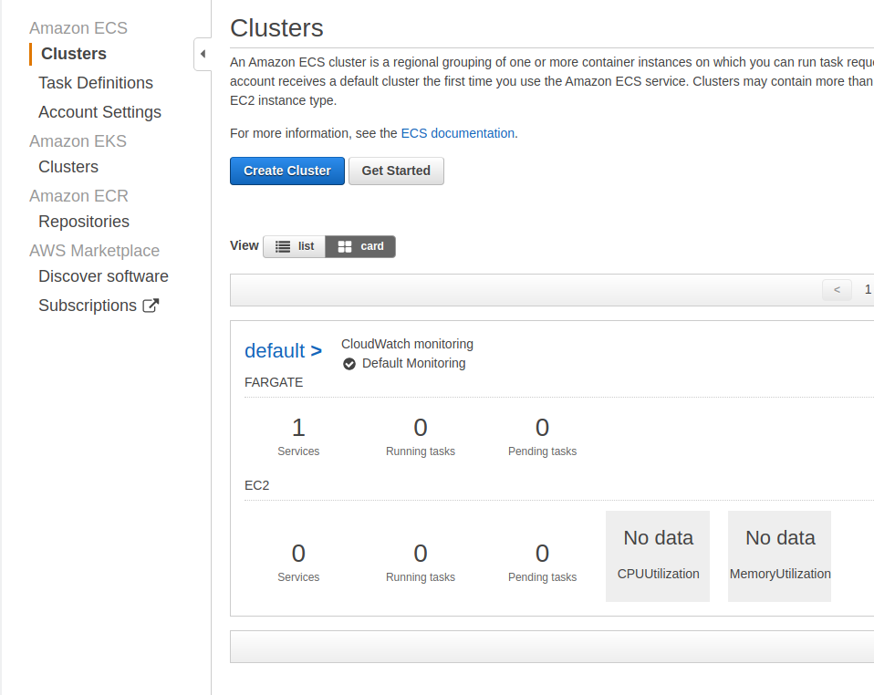

Na próxima tela clicar em EC2 Linux + Networking

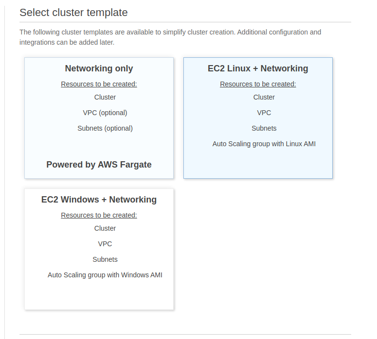

Aqui definimos o nome do cluster, deixamos a opção On-Demand (onde ele vai cobrar sobre demanda então é bom ter cuidado aqui), escolhemos a EC2 instance type para t2.micro, opção gratuita e Number of instances como 2.

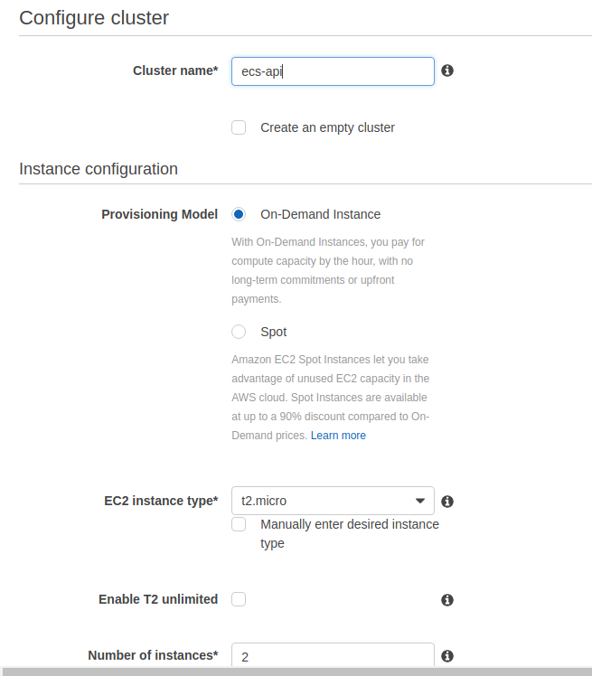

Aqui deixamos o padrão de disco como 22GB e definir a key pair, caso não possua é necessário gerar uma no EC2 Console.

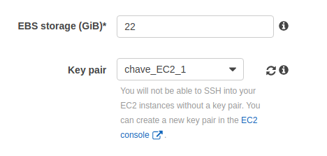

Criando uma key pair no Ec2 console. Clicar em Create Key Pair

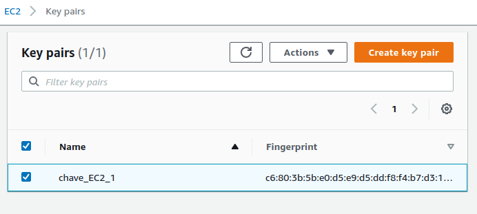

Escolher o nome da key pair e o tipo, para linux escolher pem e Windows ppk e depois Create key pair

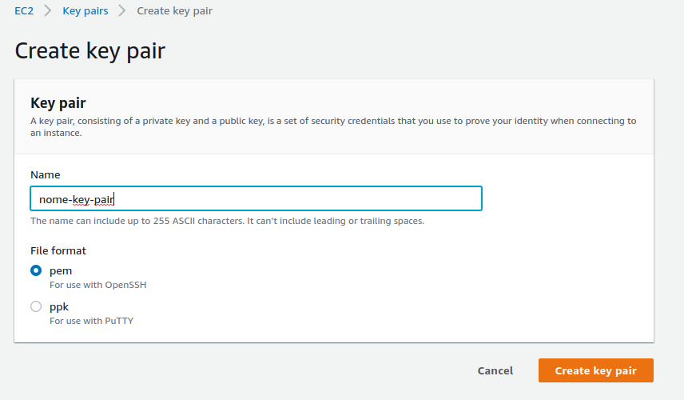

Em Networking podemos escolher a VPC, subnets e security group. Aqui cosneguimos selecionar as que foram criadas por padrão quando criamos o cluster com o Fargate.

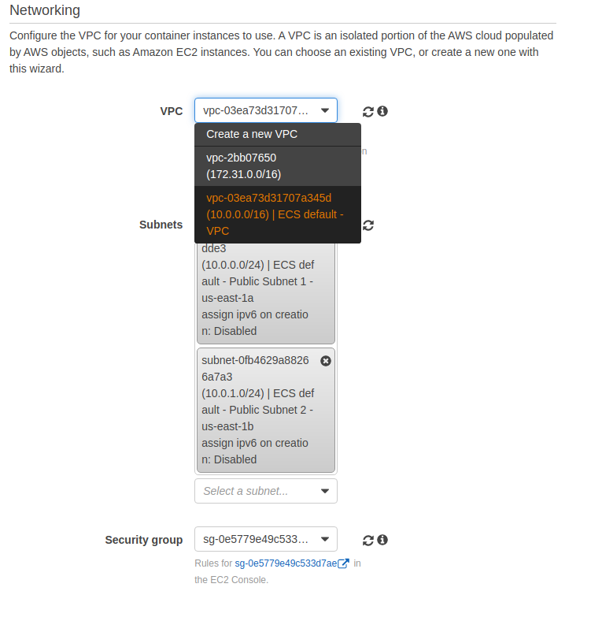

E por fim clicar em Create, ele vai fazer toda a configuração.

Feito tudo isso podemos entrar no console do EC2 e temos todas as configurações feitas e as instâncias no ar, com os volumes configurados, o security group configurado e o auto scaling habilitado, realizando o teste e terminando uma das instâncias demorou em torno de dois minutos mas ele subiu uma nova instância de EC2.

**Provisionando mais instâncias**

No console do EC2 clicando em Auto Scaling Group

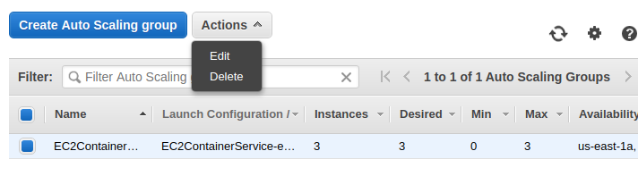

Selecionando o grupo e após em Actions e depois Edit

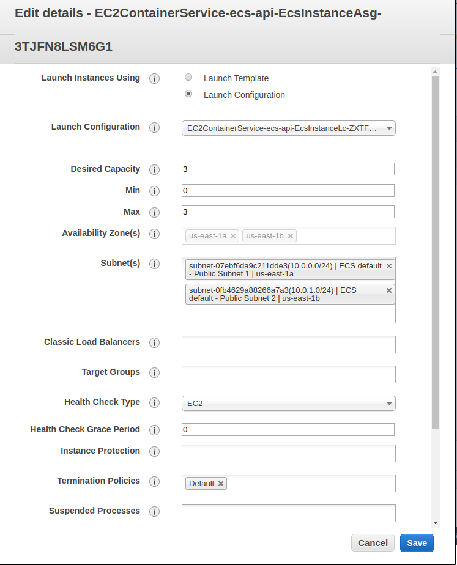

Conseguimos aumentar o número de instâncias

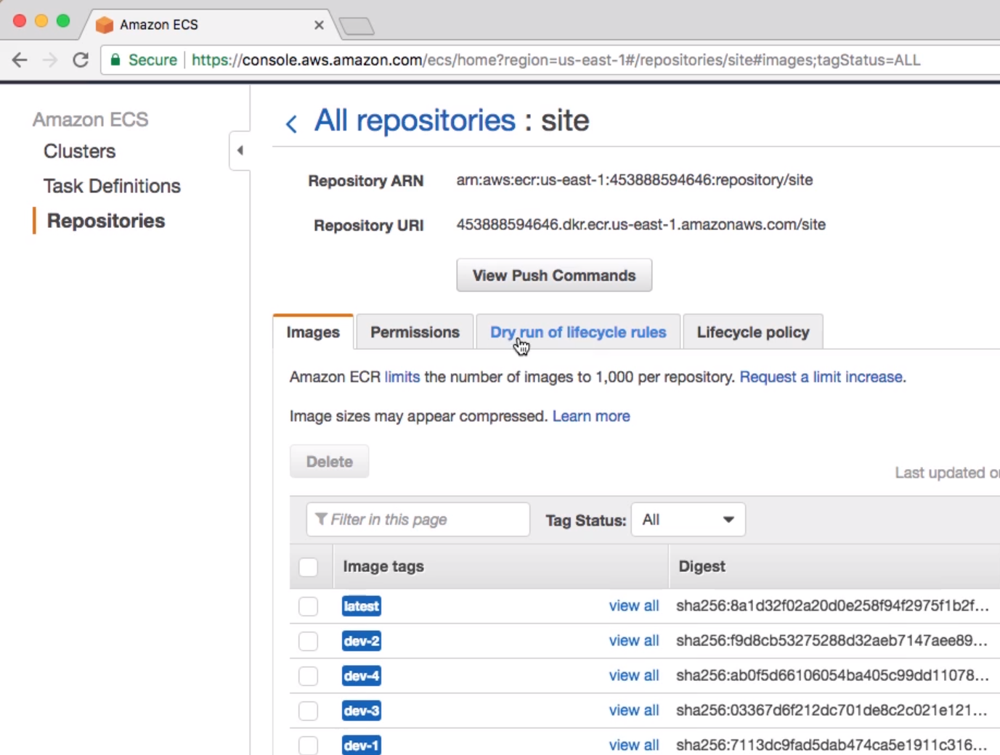

Agora fazendo esse processo por linha de comando.
```
aws autoscaling set-desired-capacity --auto-scaling-group-name EC2ContainerService-ecs-api-EcsInstanceAsg-3TJFN8LSM6G1 --desired-capacity 2

aws autoscaling describe-auto-scalling-groups //lista informações
```
**Elastic Container Registry (ECR)**

É um registry privado de containers Docker da AWS, as imagens são armazenadas com compressão de dados, o que resulta em uma vantagem financeira, já que o serviço é cobrado por espaço utilizado e através do IAM é possível vincular usuários e políticas para implementar controle de acesso ao ECR.

-   fazer um pull local de imagem

docker pull rmerces/api-monolitica

-   criar um repositório de imagens no ECR

-   No console da AWS no serviço ECS tem no menu do serviço a opção Repository
-   Nele é clicar em criar repository e nomear

-   Comando para fazer o push da imagem
```
aws ecr get-login-password --region us-east-1 | docker login --username AWS --password-stdin 470106750956.dkr.ecr.us-east-1.amazonaws.com/api-monolitica //login no ecr

docker build -t api-monolitica . //buildar a sua imagem mas no exemplo abaixo usei uma imagem pronta

docker tag rmerces/api-monolitica:latest 470106750956.dkr.ecr.us-east-1.amazonaws.com/api-monolitica:latest //usando uma imagem que já havia feito pull anteriormente

docker push 470106750956.dkr.ecr.us-east-1.amazonaws.com/api-monolitica:latest //push da imagem
```
Após no dash dos Repositories aparece a imagem com as suas tags, se houver:

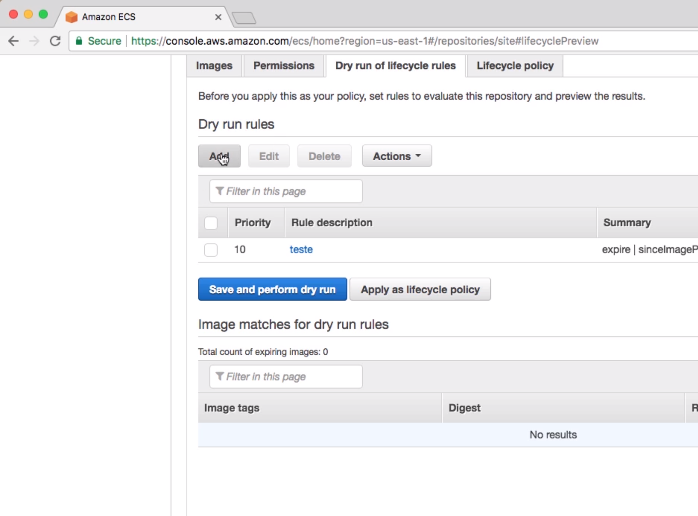

Configurar regras para gerenciamento das imagens, clicar em Dry run of lifecycles rules e depois em Add

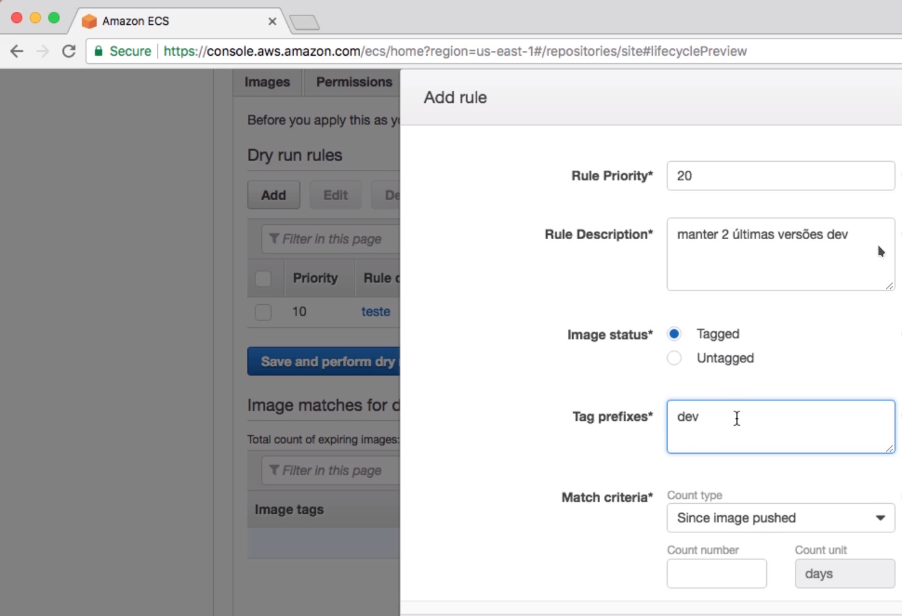

Aparece a janela de configuração das regras onde Rule Priority é um número para definir as prioridades entre as outras regras criadas, Rule Description é um texto explicativo e Tag prefixes é pra saber em qual tag essa regra deve ser aplicada aqui no exemplo nas tags com prefixo dev

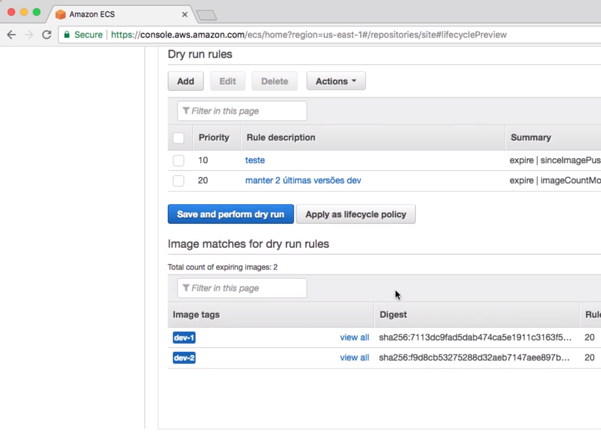

Mais abaixo definimos como 2 no campo onde definimos Image count more than

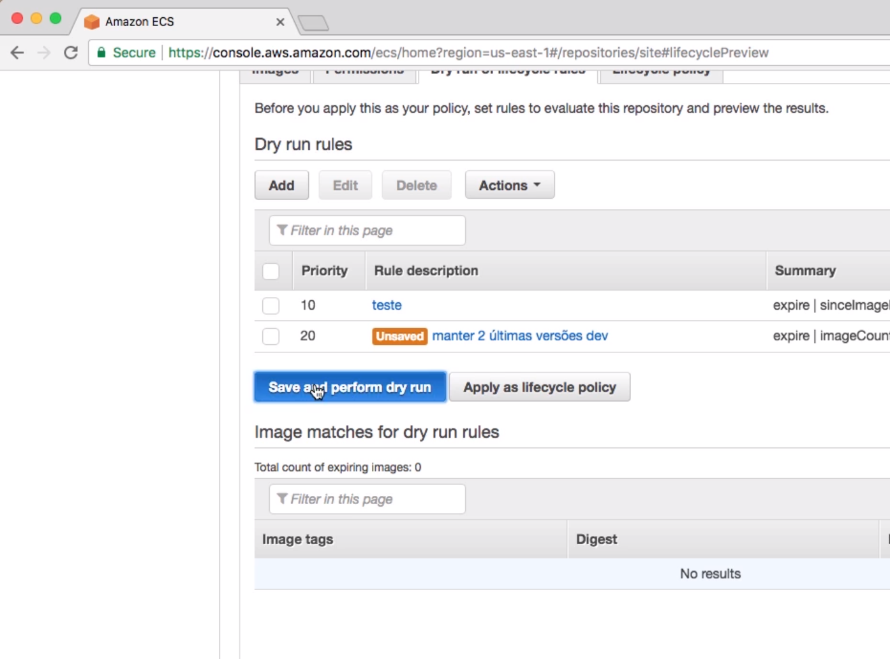

Feito isso aplicamos a nossa regra


E na nossa regra aparece as imagens que são gerenciadas pela regra


**Criando Tasks**

As *tasks* configuram os parâmetros e o ambiente dos *containers*.

Gerenciamento de tasks com cli
```
aws ecs list-tasks --cluster ecs-api

aws ecs stop-task --taks <id-task> --cluster <nome-cluster> //stop task

aws ecs list-task-definitions //lista tdoas as definições independente do cluster

aws ecs run-task --cluster ecs-api --task-definition api-monolitica //rodar uma task associando ao cluster

aws ecs run-task --cluster <nome-cluter> --task-definition <nome-task> --count 3 //subir várias instâncias
```
Criando Service

-   Escolher como EC2
-   Definir a task
-   Definir o cluster
-   Definir o nome
-   Definir o numero de tasks

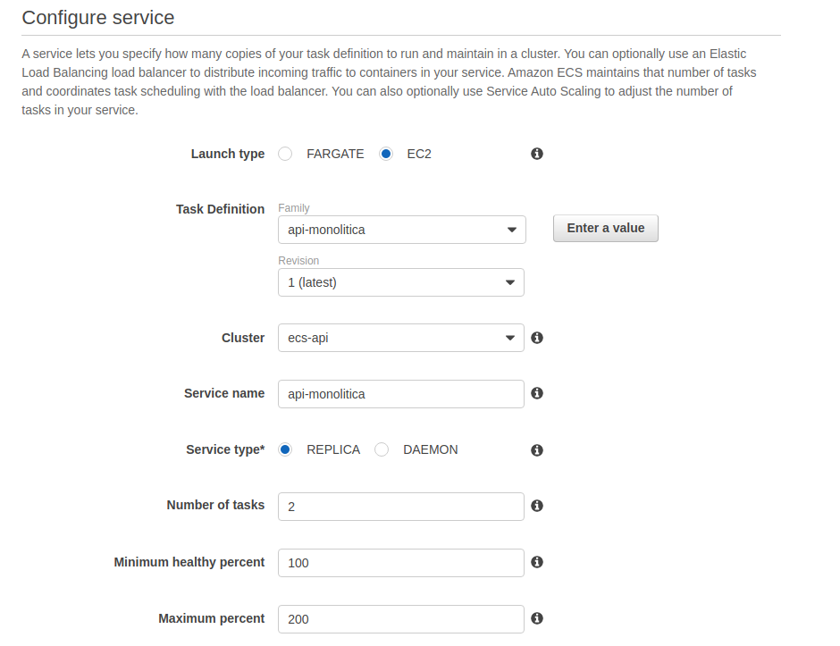

Escolher o load balance

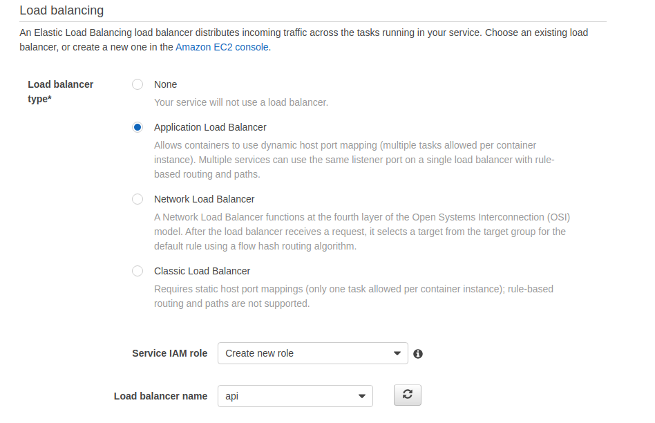

Se não tiver um criar

**Criando Load Balance**

Selecionar HTTP/HTTPS

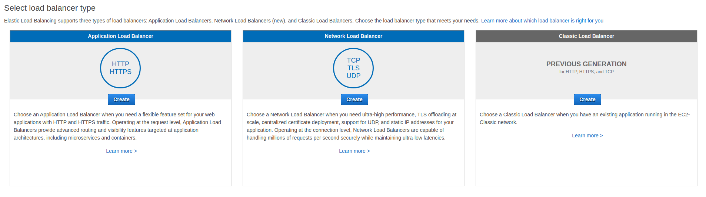

Nomear load balance e configurar a VPC e subnets, no caso usei as padrões criadas no Fargate automaticamente

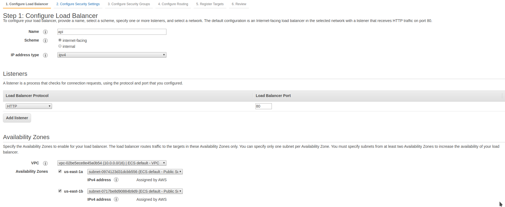

Adicionar o security group também estou usando o criado automaticamente no Fargate

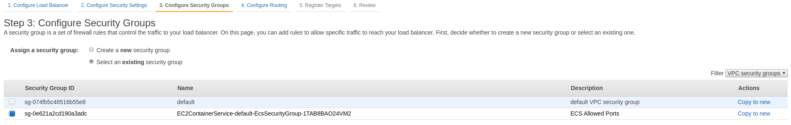

Configurar a rota, portas e etc, nesse caso só dei o nome e deixei mapeado na porta 80

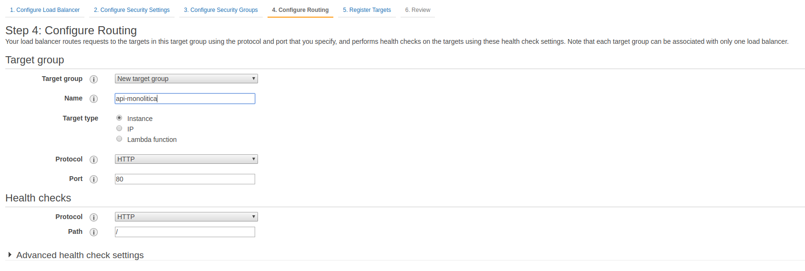

Após configurado o load balance é preciso configurar o target group

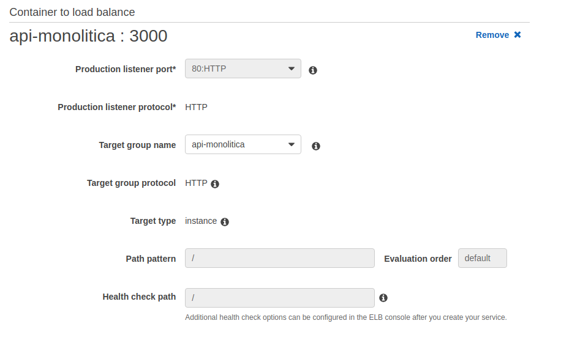

Após toda a configuração ainda é necessário configurar o security group pois com essa configuração acima liberamos o load balance na porta 80 e agora precisamos liberar o acesso interno

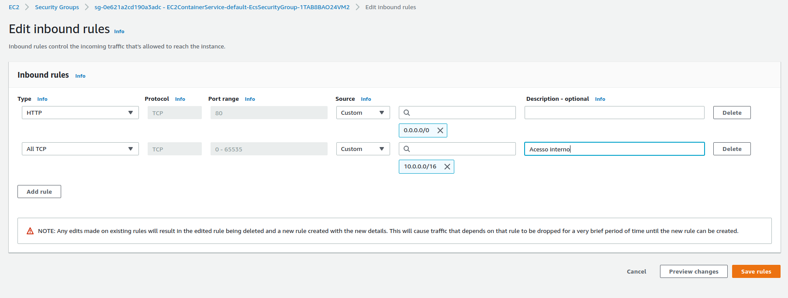

Para saber e ver qual é a rede que deve ser liberada basta acessar o serviço de VPC e ver qual IP está associado

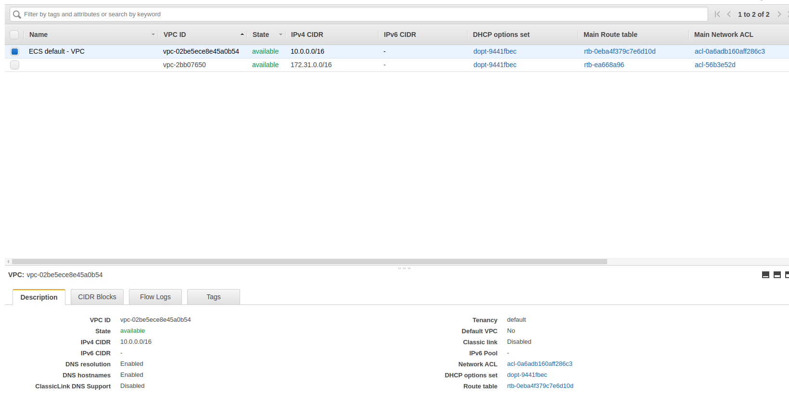

**Subindo microservices**

-   Subir três serviços, users, threads e posts usando as imagens em [DockerHUB](https://hub.docker.com/u/rmerces)
-   Criar três repositórios no ECR
-   Criar as tasks para cada repositório
-   Criar um novo load balance a unica diferença aqui é que quando estamos criando um load balance só conseguimos adicionar um target group e nesse caso teremos três, então criamos o load balance com um e depois no dash do load balance tem a opção target group e ali conseguimos adicionar os demais. E no load balance configuramos os ponteiros.
-   Após isso criar o Services