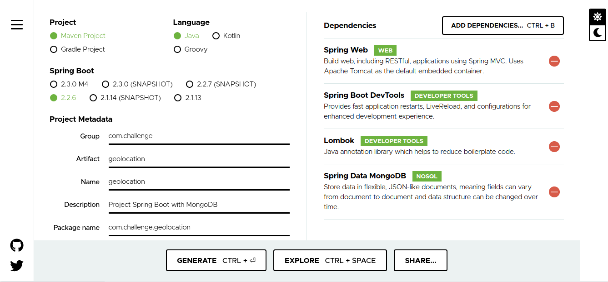

# Criando uma aplicação Spring Boot com MongoDB e geolocalização

O objetivo desse post é criar uma aplicação de geolocalização, dizer quais pontos estão próximos de você por exemplo isso é muito útil se você uma empresa de entregas e precisa saber qual fornecedor está mais próximo para a entrega e várias aplicações do gênero. Para isso usarei aqui Spring Boot, pois tem toda uma facilidade para criação do projeto e uma comunidade e documentações muito ativas, MongoDB além de ser uma boa opção por toda a flexibilidade que ele trás também é muito útil nesse cenário onde vamos precisar fazer cálculos de geolocalização e ele nativamente possui isso.
Aqui faremos só o backend da aplicação e futuramente desenvolveremos o frontend.

## Criando a aplicação Spring Boot

Para isso vamos usar o [Spring Initalizr](https://start.spring.io/), entrando na página escolhemos como queremos iniciar o projeto, aqui eu irei usar o *Spring Web* para poder fazer requisições *Rest*, também estou usando *Lombok* e *Spring DevTools* mas são mais pela facilidade que o *Lombok* fornece quando criarmos os nossos **POJOs** e o *DevTools* para podermos usar em desenvolvimento e termos o live reload da aplicação.
Então fica mais ou menos assim o projeto:


Após isso também precisamos adicionar ao projeto a dependência do **google-service-maps**, como estou usando *Maven*
```xml
<!-- https://mvnrepository.com/artifact/com.google.maps/google-maps-services -->
<dependency>
    <groupId>com.google.maps</groupId>
    <artifactId>google-maps-services</artifactId>
    <version>0.11.0</version>
</dependency>

```

Também adicione o driver do Mongo ao pom.
```xml
<dependency>
    <groupId>org.mongodb</groupId>
    <artifactId>mongo-java-driver</artifactId>
</dependency>
```

## Descrição da aplicação

Vamos emular uma rede entregas de alimentos, onde os estabelecimentos estão cadastrados e quando um usuário digitar o seu endereço e ele irá exibir os mais próximos dele.

## Model

Vamos começar o nosso model com o que seria então o **Estabelecimento** ele possuirá *nome*, *email* e a sua *localização*. Então vou começar criando a classe **Localizacao**.

```java
package com.challenge.geolocation.model;

import java.util.List;

import lombok.Data;

@Data
public class Localizacao {
	
	private String endereco;
    private List<Double> coordinates;    
    private String type = "Point";

}
```

Aqui temos o endereço mas também temos dois atributos que podem parecer um pouco estranhos o *coordinates* e o *type*. Os dois são necessários quando estamos trabalhando com geolocalização com o Mongo, o primeiro valor *coordinates* é uma lista de **double** contendo a latitude e longitude e o *type* diz respeito a um ponto no mapa, podemos ter outros *types* como **Polygon**.
Agora criando a nossa classe do estabelecimento propriamente dita.

```java
package com.challenge.geolocation.model;

import org.springframework.data.annotation.Id;
import org.springframework.data.mongodb.core.geo.GeoJsonPoint;
import org.springframework.data.mongodb.core.mapping.Document;

import lombok.Data;

package com.challenge.geolocation.model;

import org.bson.types.ObjectId;

import lombok.Data;

@Data
public class Estabelecimento{

	private ObjectId id;

	private String nome;
	private String email;
	private Localizacao localizacao;	
	
}

```

Temos aqui a classe **Estabelecimento** composta pela classe **Localizacao** e com os atributos *id* que representa o **ObjectId** do **MongoDB**, o nome e o email, podemos perceber como o uso do *lombok* nos ajuda a reduzir um pouco a verbozidade.

## Codecs

Agora temos o *Model* criado mas precisamos fazer de alguma forma pra que a nossa aplicação se comunique com o *Mongo*. Aí entra os *codecs*, ele vai ser o responsável por fazer tanto o envio como o recebimento dos objetos do *Mongo*.
Então vamos criar a classe **EstabelecimentoCodec** que implementa a interface **CollectibleCodec** do tipo **Estabelecimento**:

```java
package com.challenge.geolocation.codec;

import org.bson.BsonReader;
import org.bson.BsonValue;
import org.bson.BsonWriter;
import org.bson.codecs.CollectibleCodec;
import org.bson.codecs.DecoderContext;
import org.bson.codecs.EncoderContext;

import com.challenge.geolocation.model.Estabelecimento;

public class EstabelecimentoCodec implements CollectibleCodec<Estabelecimento>{

	@Override
	public void encode(BsonWriter writer, Estabelecimento value, EncoderContext encoderContext) {
		// TODO Auto-generated method stub
		
	}

	@Override
	public Class<Estabelecimento> getEncoderClass() {
		// TODO Auto-generated method stub
		return null;
	}

	@Override
	public Estabelecimento decode(BsonReader reader, DecoderContext decoderContext) {
		// TODO Auto-generated method stub
		return null;
	}

	@Override
	public Estabelecimento generateIdIfAbsentFromDocument(Estabelecimento document) {
		// TODO Auto-generated method stub
		return null;
	}

	@Override
	public boolean documentHasId(Estabelecimento document) {
		// TODO Auto-generated method stub
		return false;
	}

	@Override
	public BsonValue getDocumentId(Estabelecimento document) {
		// TODO Auto-generated method stub
		return null;
	}

}
```

Agora precisamos começar a implementar o codec a nossa maneira para ele poder fazer o encod e o decode, para isso vamos adicionar a classe **Codec** do pacote *bson* que nos ajuda, vamos tipa-la como um **Document** e vamos adicioná-lo ao construtor para ele ficar como dependência do nosso *codec*:

```java
import org.bson.Document;
import org.bson.codecs.Codec;

import com.challenge.geolocation.model.Estabelecimento;


public class EstabelecimentoCodec implements CollectibleCodec<Estabelecimento>{
	
	private Codec<Document> codec;
	
	public EstabelecimentoCodec(Codec<Document> codec) {
		this.codec = codec;
	}
```
Agora vamos implementar o método responsável por fazer o encode. Aqui é onde dizemos como serão salvo os nossos objetos em Java para um objeto do Mongo:
```java
@Override
public void encode(BsonWriter writer, Estabelecimento estabelecimento, EncoderContext encoder) {
    Document document = new Document();
    
    document.put("_id", estabelecimento.getId());
    document.put("nome", estabelecimento.getNome());
    document.put("email", estabelecimento.getEmail());
    
    Localizacao localizacao = estabelecimento.getLocalizacao();
    
    List<Double> coordinates = new ArrayList<>();
    localizacao.getCoordinates().forEach(coordinates::add);
    
    document.put("localizacao", new Document()
            .append("endereco", localizacao.getEndereco())
            .append("coordinates", coordinates)
            .append("type", localizacao.getType()));
    
    codec.encode(writer, document, encoder);
}
```

E aqui é onde impletamos o decode, como o Java vai interpretar o objeto retornado do Mongo:
```java
@Override
public Estabelecimento decode(BsonReader reader, DecoderContext decoderContext) {
    
    Document document = codec.decode(reader, decoderContext);
    
    Estabelecimento estabelecimento = new Estabelecimento();
    estabelecimento.setId(document.getObjectId("_id"));
    estabelecimento.setNome(document.getString("nome"));
    estabelecimento.setEmail(document.getString("email"));
    
    Document localizacao = (Document) document.get("localizacao");
    if(localizacao != null) {
        String endereco = localizacao.getString("endereco");
        @SuppressWarnings("unchecked")
        List<Double> coordinates = (List<Double>) localizacao.get("coordinates");
        
        Localizacao localizacaoEntity = new Localizacao();
        localizacaoEntity.setEndereco(endereco);
        localizacaoEntity.setCoordinates(coordinates);
        
        estabelecimento.setLocalizacao(localizacaoEntity);
    }
    
    return estabelecimento;
}
```

E temos os outros métodos que implementamos para que o codec consiga fazer a gerência dos objetos:
```java
@Override
public Class<Estabelecimento> getEncoderClass() {
    return Estabelecimento.class;
}

@Override
public Estabelecimento generateIdIfAbsentFromDocument(Estabelecimento estabelecimento) {
    return documentHasId(estabelecimento) ? estabelecimento.generateId() : estabelecimento;
}

@Override
public boolean documentHasId(Estabelecimento estabelecimento) {
    return estabelecimento.getId() == null;
}

@Override
public BsonValue getDocumentId(Estabelecimento estabelecimento) {
    if (!documentHasId(estabelecimento)) {
        throw new IllegalStateException("This Document do not have a id");
    }
    
    return new BsonString(estabelecimento.getId().toHexString());
}
```

A única coisa aqui a ressaltar foi a criação do método *generateId* no model **Estabelecimento** que fica assim:
```java
package com.challenge.geolocation.model;

import org.bson.types.ObjectId;

import lombok.Data;

@Data
public class Estabelecimento{

	private ObjectId id;

	private String nome;
	private String email;
	private Localizacao localizacao;	
	
	public Estabelecimento generateId() {
		this.setId(new ObjectId());
		return this;
	}
	
}
```