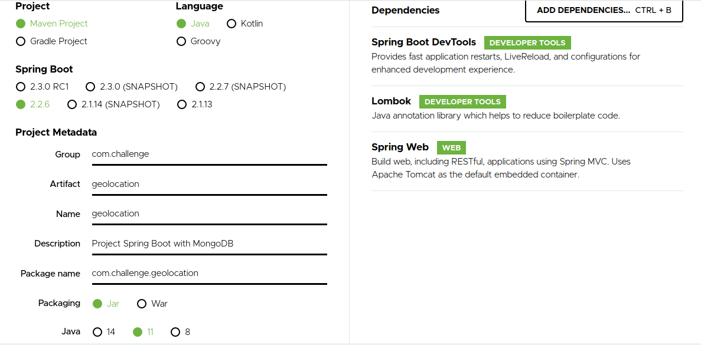

# Criando uma aplicação Spring Boot com MongoDB e geolocalização

O objetivo desse post é criar uma aplicação de geolocalização, dizer quais pontos estão próximos de você por exemplo isso é muito útil se você uma empresa de entregas e precisa saber qual fornecedor está mais próximo para a entrega e várias aplicações do gênero. Para isso usarei aqui Spring Boot, pois tem toda uma facilidade para criação do projeto e uma comunidade e documentações muito ativas, MongoDB além de ser uma boa opção por toda a flexibilidade que ele trás também é muito útil nesse cenário onde vamos precisar fazer cálculos de geolocalização e ele nativamente possui isso.
Aqui faremos só o backend da aplicação e futuramente desenvolveremos o frontend.

## Criando a aplicação Spring Boot

Para isso vamos usar o [Spring Initalizr](https://start.spring.io/), entrando na página escolhemos como queremos iniciar o projeto, aqui eu irei usar o *Spring Web* para poder fazer requisições *Rest*, o *Spring Data MongoDB*, que já nos auxilia fornecendo uma interface para as consultas e os codecs para trabalharmos com os objetos Java e o Mongo, também estou usando *Lombok* e *Spring DevTools* mas são mais pela facilidade que o *Lombok* fornece quando criarmos os nossos **POJOs** e o *DevTools* para podermos usar em desenvolvimento e termos o live reload da aplicação.
Então fica mais ou menos assim o projeto:


Após isso também precisamos adicionar ao projeto a dependência do **google-service-maps**, como estou usando *Maven*
```xml
<!-- https://mvnrepository.com/artifact/com.google.maps/google-maps-services -->
<dependency>
    <groupId>com.google.maps</groupId>
    <artifactId>google-maps-services</artifactId>
    <version>0.11.0</version>
</dependency>

```

## Descrição da aplicação

Vamos emular uma rede entregas de alimentos, onde os estabelecimentos estão cadastrados e quando um usuário digitar o seu endereço e ele irá exibir os mais próximos dele.

## Model

Vamos começar o nosso model com o que seria então o **Estabelecimento** ele possuirá *nome*, *email*, *endereço* e a sua *localização*

```java
package com.challenge.geolocation.model;

import org.springframework.data.annotation.Id;
import org.springframework.data.mongodb.core.geo.GeoJsonPoint;
import org.springframework.data.mongodb.core.mapping.Document;

import lombok.Data;

@Data
@Document(collection = "estabelecimento")
public class Estabelecimento {
	
	@Id
	private String id;

	private String nome;
	private String email;
	private String endereco;
	
	/**
	 * {@code location} is stored in GeoJSON format.
	 *
	 * <pre>
	 * <code>
	 * {
	 *   "type" : "Point",
	 *   "coordinates" : [ x, y ]
	 * }
	 * </code>
	 * </pre>
	 */
	private GeoJsonPoint location;
	
}

```

Com o uso do *lombok* conseguios reduzir um pouco a verbozidade e com a classe **GeoJsonPoint** conseguimos abstrair detalhes de implementação, pois o **Mongo** exige que para geolocalização exista um array chamados *coordinates* e que seja especificado o seu *type* que nesse caso usamos o **Point** pois é o que representa melhor o que queremos que é justamente um ponto em um mapa.

**Existem outros tipos como Polygon por exemplo*

Criado o nosso model iremos já fazer o inserção desses valores no Mongo:

```json

{
    "nome" : "Mercado I",
    "email" : "contato@mercadoI.com",
    "endereco" : "Rua Brigadeiro Tobias n 780",
    "location" : {
        "latitude" : -23.53624,
        "longitude" : -46.63395
    }
}

{
    "nome" : "Mercado II",
    "email" : "mercadoII@contato.com",
    "endereco" : "R. Brg. Tobias, 206 - Santa Ifigênia, São Paulo - SP, 01032-000",
    "location" : {
        "latitude" : -23.54165,
        "longitude" : -46.63583
    }
}

{
    "nome" : "Mercado III",
    "email" : "mercadoIII@contato.com",
    "endereco" : "Av. Cásper Líbero, 42 - Centro Histórico De São Paulo, São Paulo - SP, 01033-000",
    "location" : {
        "latitude" : -23.54132,
        "longitude" : -46.63643
    }
}

{
    "nome" : "Mercado IV",
    "email" : "mercadoIV@contato.com",
    "endereco" : "Av. Rio Branco, 630 - República, São Paulo - SP, 01205-000",
    "location" : {
        "latitude" : -23.53984,
        "longitude" : -46.64008
    }
}

{
    "nome" : "Mercado V",
    "email" : "mercadoV@contato.com",
    "endereco" : "Alameda Barão de Limeira, 425 - Campos Elíseos, São Paulo - SP, 01202-900",
    "location" : {
        "latitude" : -23.53386,
        "longitude" : -46.6482
    }
}

{
    "nome" : "Mercado VI",
    "email" : "mercadoVI@contato.com",
    "endereco" : "R. Canuto do Val, 41 - Santa Cecilia, São Paulo - SP, 01224-040",
    "location" : {
        "latitude" : -23.54062,
        "longitude" : -46.65114
    }
}
```

Agora já temos o modelo mapeado na aplicação e os dados no banco de dados.


## Repository

Agora passamos para o **Repository** responsável por conter os métodos que farão as consultas e manipulações no nosse schema de dados:

```java
package com.challenge.geolocation.repository;

import java.util.List;

import org.springframework.data.mongodb.core.geo.GeoJsonPoint;
import org.springframework.data.repository.CrudRepository;
import org.springframework.stereotype.Repository;

import com.challenge.geolocation.model.Estabelecimento;

@Repository
public interface EstabelecimentoRepository extends CrudRepository<Estabelecimento, String> {
	
	List<Estabelecimento> findByLocationWithin(GeoJsonPoint location);
	
}


```

Como estamos usando *Spring Data* basta criarmos uma *interface* e aqui estendemos da classe **CrudRepository** e definimos o seu tipo como sendo do nosso modelo mapeado e qual o seu id no caso *String* e fazendo uso da feature de *query methods* adicionamos a nossa consulta por geolocalização.

