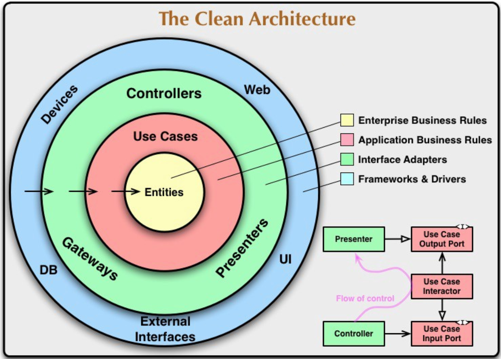

# Arquitetura e Arquitetura limpa

## O que é Arquitetura?

Resumindo arquitetura de software pode ser descrito da seguinte forma: _"... a arquitetura envolve: decisões sobre as estruturas que formarão o sistema, controle, protocolos de comunicação, sincronização e acesso a dados, atribuição de funcionalidade a elementos do sistema, distribuição física dos elementos escalabilidade e desempenho e outros atributos de qualidade."_

Quebrando um pouco mais essa explicação e tentando deixá-la mais suscinta eu diria que a arquitetura de software é a ideia que trata da relação entre o mapeamento de componentes de um software e os detalhes que são levados em conta na hora de implementar esses elementos na forma de código.

Resumindo ainda mais a arquitetura consiste em um modelo de alto nível que possibilita um entendimento e uma análise mais fácil do software a ser desenvolvido.  

Como o nome diz e levando pro mundo real é como ver um arquiteto de uma casa onde ele desenha a planta e todas as partes da construção se encaixam e como elas devem interagir uma com a outra.

## Por que existe?

A ideia de arquitetura de software surgiu nos anos 60 e se tornou popular nos anos 90.

A ideia era enfatizar a importância de estruturar um sistema antes de seu desenvolvimento.

## O que resolve?

A ideia é que uma boa arquitetura resolva parafrasenado Robert Martin (Uncle Bob):

_"O objetivo da arquitetura de software é minimizar os recursos humanos necessários para construir e manter um determinado sistema."_

A ideia é que com uma boa arquitetura o custo para mudanças não alto, que uma simples mudança não entrave a aplicação.

## Arquitetura limpa

Com esses conceitos em mente por volta de 2012 Robert C. Martin (Uncle Bob) criou a Arquitetura Limpa, um estilo com similaridades com a Arquitetura Cebola ec Arquitetura Hexagonal.

### O que resolve?

A arquitetura limpa tem como ideia principal, a modulação das informações que serão codificadas, facilitando a manutenção; os módulos precisam ser independentes o suficiente para que possam ser trabalhados pelos desenvolvedores únicos em equipes diferentes

- Independência entre componentes, quer dizer cada módulo não conhece o outro, então mudanças em cada módulo não quebram ou necessitam de ajustes nos demais.

- Independência de framework, os frameworks que tanto gostamos aqui são tratados como meros detalhes, as aplicações não são mais amarradas ao framework, podendo assim haver substituição rápida de um framework por outro sem nenhum impacto na aplicação.

- Independência de banco de dados, assim como os frameworks o banco de dados é tratado como um detalhe.
  
- Testabilidade aqui vale um ponto importante, quanto mais fácil for pro seu sistema ser testado menos acoplamento ele terá isso significa que mudanças serão faceis de ocorrer e de serem testadas.
  
- Independência de interface de usuário, seja um GUI, API ou que quer que seja deve haver independência e não deve interferir no funcionamento do sistema.
  
- Independência de agentes externos, a nossa regra de negócio não deve depender de nada externo.

### Como funciona?

Neste modelo proposto por Robert C. Martin, Uncle Bob, a arquitetura é representada por camadas circulares concêntricas passando a proposta de baixo acoplamento e alta coesão:

#### Acoplamento

Dizemos sobre acoplamento em um software quando as partes que o compõe são altamente dependentes umas das outras o que dificulta a manutenção os testes e ainda mais mudanças.

#### Coesão

Dizemos sobre baixa coesão em um software quando uma parte dele realiza diversas tarefas ou possui multiplas responsabilidades.

Buscamos sempre um sistema que tenha baixo acoplamento e alta coesão. Na imagem abaixo vemos como a Arquitetura Limpa demonstra como resolver essas questões:


Começando do centro pra fora:

# Entidades
A Entidade é a camada mais ao centro e mais alta na Arquitetura Limpa, é aqui onde devem ficar os objetos de domínio da aplicação, as regras de negócio cruciais e que não irão mudar com facilidade.

# Casos de Uso
Casos de uso contém regras de negócio mais específicas referente à aplicação, ele especifíca a entrada a ser fornecida, a saída a ser retornada e os passos de processamento envolvidos.

_Vale ressaltar que aqui fica claro a ideia de Inversão de Dependência já que os Casos de Uso conhecem e dependem das Entidades mas as Entidades nem conhecem e nem precisam dos Casos de Uso para poderem funcionar._

# Adaptadores de Interface
Camada que tem como finalidade converter dados da maneira mais acessível e conveniente possível para as camadas Entidades e Casos de Uso. Um exemplo seria o uso de _Mapper's_, onde eu poderia controlar as estruturas transmitidas entre Casos de Uso e Entidades com o interface do usuário, por exemplo.

# Frameworks e Drivers
Contém qualquer frameworks ou ferramentas para poder rodar na aplicação.

## Exemplo prático

Ápos toda a teoria vamos mostrar na prática com um projeto simples onde teremos três pontos de entrada da aplicação.

Com o desenrolar do projeto vamos perceber que nesse modelo arquitetural o mais importante são as camadas mais internas e as mais externas serão tratados como detalhe e é aí que mora a quebra de tabu da Arquitetura Limpa, pois o foco é no negócio e não nas tecnologias; mas ainda estamos trabalhando com um sistema automatizado e precisamos seguir alguns paradigmas, mas só o que é realmente indispensável.

Vamos fazer um projeto de cadastro de **Power Rangers**, nele um usuário vai enviar os seus dados e a aplicação irá criar um Ranger de uma cor dependendo de algumas características.

Vamos usar a linguagem **Java** como um projeto modular **Maven** e a partir dele conseguimos modularizar as nossas camadas.

## Criando projeto

Dentro do nosso diretória vmos criar um arquivos _pom.xml_, esse arquivos vai ser o raiz da nossa aplicação, é nele que teremos as dependências declaradas com suas versões que usuaremos e também teremos aqui a declaração dos nossos módulos, segue o exemplo:

```xml
<?xml version="1.0" encoding="UTF-8"?>
<project xmlns="http://maven.apache.org/POM/4.0.0"
	xmlns:xsi="http://www.w3.org/2001/XMLSchema-instance"
	xsi:schemaLocation="http://maven.apache.org/POM/4.0.0 http://maven.apache.org/xsd/maven-4.0.0.xsd">
	<modelVersion>4.0.0</modelVersion>

	<groupId>com.gogo.powerrangers</groupId>
	<artifactId>clean-architecture-example</artifactId>
	<packaging>pom</packaging>
	<version>1.0</version>
	<modules>
		<module>entity</module>
	</modules>

	<properties>
		<revision>1.0</revision>
		<project.build.sourceEncoding>UTF-8</project.build.sourceEncoding>
		<java.version>11</java.version>
		<lombok-version>1.18.10</lombok-version>
		<maven.compiler.source>${java.version}</maven.compiler.source>
		<maven.compiler.target>${java.version}</maven.compiler.target>
		<junit-jupiter.version>5.5.1</junit-jupiter.version>
		<junit-platform>1.5.1</junit-platform>
	</properties>

	<dependencyManagement>
		<dependencies>

			<!-- Jupiter -->
			<dependency>
				<groupId>org.junit.jupiter</groupId>
				<artifactId>junit-jupiter-api</artifactId>
				<version>${junit-jupiter.version}</version>
				<scope>test</scope>
			</dependency>
			<dependency>
				<groupId>org.junit.jupiter</groupId>
				<artifactId>junit-jupiter-engine</artifactId>
				<version>${junit-jupiter.version}</version>
				<scope>test</scope>
			</dependency>
			<dependency>
				<groupId>org.junit.platform</groupId>
				<artifactId>junit-platform-launcher</artifactId>
				<version>${junit-platform}</version>
				<scope>test</scope>
			</dependency>
			<dependency>
				<groupId>org.junit.platform</groupId>
				<artifactId>junit-platform-runner</artifactId>
				<version>${junit-platform}</version>
				<scope>test</scope>
			</dependency>

		</dependencies>
	</dependencyManagement>


</project>
```

Aqui temos o mínimo para começar, temos a declaração da versão do java, o **JUnit** que será o nosso framework de testes unitários e temos a declaração do nosso primeiro módulo chamado _entity_.

## Entidade

Agora vamos para a nossa entidade, esse é o ponto mais ao centro e mais acima do nosso projeto, dentro dele devemos ter os nossos objetos de domínio e regras de negócio que podem viver sem um sistema automatizado. Esse é o módulo que será visto por todos os outros mas não conhece os demais, ele é totalmente isolado de dependências externas.

Então pensando no nosso projeto aqui modelamos o nosso domínio de ususários, onde vamos ter o nome, email, idade, personalidade e o nome do ranger que será criado.

Vamos criar um diretório onde está o nosso _pom_ raiz com o nome de _entity_ e dentro dele vamos criar o _pom.xml_ da nossa _entity_:

```xml
<?xml version="1.0" encoding="UTF-8"?>
<project xmlns="http://maven.apache.org/POM/4.0.0"
	xmlns:xsi="http://www.w3.org/2001/XMLSchema-instance"
	xsi:schemaLocation="http://maven.apache.org/POM/4.0.0 http://maven.apache.org/xsd/maven-4.0.0.xsd">

	<parent>
		<artifactId>clean-architecture-example</artifactId>
		<groupId>com.gogo.powerrangers</groupId>
		<version>1.0</version>
	</parent>

	<modelVersion>4.0.0</modelVersion>

	<artifactId>entity</artifactId>
	<version>${revision}</version>

	<build>
		<plugins>
			<plugin>
				<groupId>org.apache.maven.plugins</groupId>
				<artifactId>maven-compiler-plugin</artifactId>
				<configuration>
					<source>11</source>
					<target>11</target>
				</configuration>
			</plugin>
		</plugins>
	</build>

	<dependencies>

		<!-- Jupiter -->
		<dependency>
			<groupId>org.junit.jupiter</groupId>
			<artifactId>junit-jupiter-api</artifactId>
		</dependency>
		<dependency>
			<groupId>org.junit.jupiter</groupId>
			<artifactId>junit-jupiter-engine</artifactId>
		</dependency>
		<dependency>
			<groupId>org.junit.platform</groupId>
			<artifactId>junit-platform-launcher</artifactId>
		</dependency>
		<dependency>
			<groupId>org.junit.platform</groupId>
			<artifactId>junit-platform-runner</artifactId>
		</dependency>

	</dependencies>

</project>
```

Podemos ver que nesse pom temos somente a versão do Java e o JUnit que nos ajudará a fazer os testes unitários.

Vamos criar a nosso primeira classe de domínio que chamaremos de **User** e vamos ter os atributos que definimos do nosso usuários:

```java
package com.gogo.powerrangers.entity;

public class User {

    private final String name;
    private final String email;
    private final int age;
    private final Personality personality;
    private final String ranger;

    User(String name, String email, int age, Personality personality, String ranger) {
        this.name = name;
        this.email = email;
        this.age = age;
        this.personality = personality;
        this.ranger = ranger;
    }

    public String getRanger() {
        return ranger;
    }
    public String getName() {
        return name;
    }
    public String getEmail() {
        return email;
    }
    public int getAge() {
        return age;
    }
    public Personality getPersonality() {
        return personality;
    }
}
```

Temos aqui a nossa entidade e colocamos um **Enum** pra Personalidade e um construtor com acessibilidade _package default_ que é um construtor que só pode ser acessado dentro do pacote onde ele foi declarado e criamos apenas os _getters_.

Agora temos a nossa entidade que é um **POJO** e vamos adicionar nesse projeto a regra de negócio que pode viver sem existir uma aplicação.

No universo dos **Power Rangers** cada ranger é escolhido de acordo com a sua personalidade, pra cada tipo de personalidade uma cor diferente e essa regra é independente de existir um software ou não, é uma regra dos **Power Rangers** então essa regra pertence a **Entidade**.

Pra isso eu vou separar essa definição para acontecer no momento em que um usuário for criado, então vamos usar um padrão de **Builder** para criar o nosso usuário e definir qual a cor do ranger de acordo com a sua pernsonalidade:

```java
package com.gogo.powerrangers.entity;

public final class UserBuilder {

    private String name;
    private String email;
    private int age;
    private Personality personality;
    private String ranger;

    UserBuilder() {
    }

    public UserBuilder name(String name) {
        this.name = name;
        return this;
    }

    public UserBuilder email(String email) {
        this.email = email;
        return this;
    }

    public UserBuilder age(int age) {
        this.age = age;
        return this;
    }

    public UserBuilder personality(String personality) {
        this.personality = Personality.of(personality);
        this.ranger = this.discoverRanger(this.personality);
        return this;
    }

    public User build() {
        return new User(this.name, this.email, this.age, this.personality, this.ranger);
    }

    private String discoverRanger(Personality personality) {
        switch (personality) {
            case LIDERANCA:
                return "Vermelho";

            case ENTUSIASMO:
                return "Preto";

            case TRANQUILIDADE:
                return "Amarelo";

            case INTELIGENCIA:
                return "Azul";

            case RIQUEZA:
                return "Rosa";

            case PERSISTENCIA:
                return "Verde";

            case FORCA:
                return "Branco";

            default:
                return "";
        }
    }
}

```

Aqui temos a criação de um **User** e já temos a definição da cor do ranger de acordo com a personalidade, vamos também adicionar o nosso builder dentro da nossa classe **User**:
```java
    public static UserBuilder builder() {
        return new UserBuilder();
    }
```

## Casos de uso

Agora que criamos a nossa entidade vamos criar a próxima camada que são os Casos de Uso. Nem toda regra de negócio é pura como a regra de negócio que está na Entidade, algumas regras de negócio fazem sentido existirem em um sistema automatizado, software, e é aqui que eles são usados, nos Casos de Uso, aqui faremos validações, controle de fluxo e temos as portas de comunicação com os adapatadores, como no caso de persistência de dados.

Então vamos criar um novo diretório chamado _usecase_ e nele teremos um arquivo _pom.xml_:

```xml
<?xml version="1.0" encoding="UTF-8"?>
<project xmlns="http://maven.apache.org/POM/4.0.0"
         xmlns:xsi="http://www.w3.org/2001/XMLSchema-instance"
         xsi:schemaLocation="http://maven.apache.org/POM/4.0.0 http://maven.apache.org/xsd/maven-4.0.0.xsd">
    <parent>
        <artifactId>clean-architecture-example</artifactId>
        <groupId>com.gogo.powerrangers</groupId>
        <version>1.0</version>
    </parent>
    <modelVersion>4.0.0</modelVersion>

    <artifactId>usecase</artifactId>
    <version>${revision}</version>

    <build>
        <plugins>
            <plugin>
                <groupId>org.apache.maven.plugins</groupId>
                <artifactId>maven-compiler-plugin</artifactId>
                <configuration>
                    <source>11</source>
                    <target>11</target>
                </configuration>
            </plugin>
        </plugins>
    </build>

    <dependencies>

        <dependency>
            <groupId>com.gogo.powerrangers</groupId>
            <artifactId>entity</artifactId>
            <version>${revision}</version>
        </dependency>

        <!-- Unit Test -->
        <dependency>
            <groupId>org.junit.jupiter</groupId>
            <artifactId>junit-jupiter-api</artifactId>
        </dependency>
        <dependency>
            <groupId>org.junit.jupiter</groupId>
            <artifactId>junit-jupiter-engine</artifactId>
        </dependency>
        <dependency>
            <groupId>org.junit.platform</groupId>
            <artifactId>junit-platform-launcher</artifactId>
        </dependency>
        <dependency>
            <groupId>org.junit.platform</groupId>
            <artifactId>junit-platform-runner</artifactId>
        </dependency>
    </dependencies>
</project>
```

Aqui temos a dependência da _entity_ e vamos criar o nosso primeiro caso de uso, a criação de um usuário. Criamos uma classe com nome **CreateUser** com um método create que irá receber um **User** e irá aplicar as validações necessárias para criar um usuário e iremos persistir essa informação em algum lugar. Não especificamos onde iremos persistir pois aqui isso é um mero detalhe que não é da preocupação dos Casos de Uso, podemos usar **JDBC** puro, **Spring Data**, cache em memória ou arquivo de texto essa responsabilidade não nos interessa aqui.

```java
package com.gogo.powerrangers.usecase;

import com.gogo.powerrangers.entity.User;

public class CreateUser {

    public CreateUser() {
        
    }

    public User create(final User user) {


        return user;
    }
}
```

Vamos adicionar primeiramente a nossa validação, aqui vamos imaginar que o usuário não pode ser menor de 18 anos e não pode ser repetido e iremos verificar pelo email essa informação.
Vamos criar uma classe chamada **UserValidator**:

```java
package com.gogo.powerrangers.usecase.validator;

import com.gogo.powerrangers.entity.User;
import com.gogo.powerrangers.usecase.exception.PowerRangerNotFoundException;
import com.gogo.powerrangers.usecase.exception.UserValidationException;

import static java.util.Objects.isNull;

public class UserValidator {

    public static void validateCreateUser(final User user) {
        if(isNull(user)) {
            throw new UserValidationException("Usuario nao pode ser null");
        }
        if(user.getAge() < 18) {
            throw new UserValidationException("Usuario deve ser maior de 18 anos");
        }
        if(user.getPersonality().getPersonality().isEmpty()){
            throw new PowerRangerNotFoundException("Power Ranger não localizado com personalidade informada");
        }
    }
}
```
Aqui temos a nossa validação e customizamos as nossas **Exceptions** com a **UserValidationException** e a **PowerRangerNotFoundException**, em seguida acionamos o nosso método estático a nossa classe de criação de usuário:
```java
package com.gogo.powerrangers.usecase;

import com.gogo.powerrangers.entity.User;
import com.gogo.powerrangers.usecase.exception.UserAlreadyExistsException;
import com.gogo.powerrangers.usecase.validator.UserValidator;

public class CreateUser {

    private final UserRepository repository;

    public CreateUser(UserRepository repository) {
        this.repository = repository;
    }

    public User create(final User user) {

        UserValidator.validateCreateUser(user);
        if (repository.findByEmail(user.getEmail()).isPresent()) {
            throw new UserAlreadyExistsException(user.getEmail());
        }

        return user;
    }
}

```

Pronto temos a nosa validação e agora precisamos de alguma forma informar que queremos persistir essa informação, porém como fazer isso se os drivers e frameworks estão na camada mais externa e a ideia aqui é deixar o Caso de Uso desacoplado de deles?

Usaremos _interfaces_ e inversão de controle, trocando em miúdos vamos dizer na nossa classe **CreateUser** que queremos salvar um usuário mas como ele será salvo já não nos importa.

Então vamos criar a interface **UserRepository** com os métodos que queremos:
```java
package com.gogo.powerrangers.usecase.port;

import com.gogo.powerrangers.entity.User;

import java.util.List;
import java.util.Optional;

public interface UserRepository {

    User create(User user);

    Optional<User> findByEmail(String email);

    Optional<List<User>> findAllUsers();
}
```
O resultado final da **CreateUser** fica:
```java
package com.gogo.powerrangers.usecase;

import com.gogo.powerrangers.entity.User;
import com.gogo.powerrangers.usecase.exception.UserAlreadyExistsException;
import com.gogo.powerrangers.usecase.port.UserRepository;
import com.gogo.powerrangers.usecase.validator.UserValidator;

public class CreateUser {

    private final UserRepository repository;

    public CreateUser(UserRepository repository) {
        this.repository = repository;
    }

    public User create(final User user) {

        UserValidator.validateCreateUser(user);
        if (repository.findByEmail(user.getEmail()).isPresent()) {
            throw new UserAlreadyExistsException(user.getEmail());
        }

        var createdUser = repository.create(user);

        return createdUser;
    }
}
```

## Adaptadores de interface

Nessa camada podemos ver que exitem os nossos **Controllers**, **Gateways** e **Presenters**, aqui temos a comunicação pra dentro das nossa **Entidades** mas também a comunicação externa e representação do objeto de retorno que será exposto.

Vamos criar um diretório chamado _adapter_ e dentro dele outro diretório chamado _controller_ e um arquivos _pom.xml_ que terá como dependência a _entity_ e aa _usecase_:
```xml
<?xml version="1.0" encoding="UTF-8"?>
<project xmlns="http://maven.apache.org/POM/4.0.0"
         xmlns:xsi="http://www.w3.org/2001/XMLSchema-instance"
         xsi:schemaLocation="http://maven.apache.org/POM/4.0.0 http://maven.apache.org/xsd/maven-4.0.0.xsd">
    <parent>
        <artifactId>clean-architecture-example</artifactId>
        <groupId>com.gogo.powerrangers</groupId>
        <version>1.0</version>
        <relativePath>../../../clean-architecture-example/pom.xml</relativePath>
    </parent>
    <modelVersion>4.0.0</modelVersion>

    <artifactId>controller</artifactId>
    <version>${revision}</version>

    <build>
        <plugins>
            <plugin>
                <groupId>org.apache.maven.plugins</groupId>
                <artifactId>maven-compiler-plugin</artifactId>
                <configuration>
                    <source>11</source>
                    <target>11</target>
                </configuration>
            </plugin>
        </plugins>
    </build>

    <dependencies>

        <dependency>
            <groupId>com.gogo.powerrangers</groupId>
            <artifactId>entity</artifactId>
            <version>${revision}</version>
        </dependency>

        <dependency>
            <groupId>com.gogo.powerrangers</groupId>
            <artifactId>usecase</artifactId>
            <version>${revision}</version>
        </dependency>
</project>
```

Vamos começar aqui criando o nosso objeto de resposta da nossa aplicação, não queremos que a nossa entidade seja retornada aqui pois caso a apresentação seja alterada temos um ponto unico de alteração e podemos ainda aqui realizar qualquer transformação que seja importante para exibição. Então criamos a classe **UserModel**:
```java
package com.gogo.powerrangers.model;

import com.gogo.powerrangers.entity.User;

public class UserModel {

    private String name;
    private String email;
    private int age;
    private String personality;
    private String ranger;

    public static UserModel mapToUserModel(User user) {

        var userModel = new UserModel();
        userModel.name = user.getName();
        userModel.email = user.getEmail();
        userModel.age = user.getAge();
        userModel.personality = user.getPersonality().getPersonality();
        userModel.ranger = user.getRanger();

        return userModel;
    }

    public static User mapToUser(UserModel userModel) {
        //@formatter:off
        return User.builder().name(userModel.getName())
                             .age(userModel.getAge())
                             .email(userModel.getEmail())
                             .personality(userModel.getPersonality())
                             .build();
        //@formatter:on
    }

    @Override
    public String toString() {
        return "UserModel{" +
                "name='" + name + '\'' +
                ", email='" + email + '\'' +
                ", age=" + age +
                ", personality='" + personality + '\'' +
                ", ranger='" + ranger + '\'' +
                '}';
    }

	public String getName() {
		return name;
	}

	public void setName(String name) {
		this.name = name;
	}

	public String getEmail() {
		return email;
	}

	public void setEmail(String email) {
		this.email = email;
	}

	public int getAge() {
		return age;
	}

	public void setAge(int age) {
		this.age = age;
	}

	public String getPersonality() {
		return personality;
	}

	public void setPersonality(String personality) {
		this.personality = personality;
	}

	public String getRanger() {
		return ranger;
	}

	public void setRanger(String ranger) {
		this.ranger = ranger;
	}
}
```

Aqui temos os métodos que fazem a mudança de _Model-to-User_ e _User-to-Model_ e agora vamos criar o nosso controlador:
```java
package com.gogo.powerrangers;

import com.gogo.powerrangers.model.UserModel;
import com.gogo.powerrangers.usecase.CreateUser;

public class UserController {

    private final CreateUser createUser;

    public UserController(CreateUser createUser){
        this.createUser = createUser;
    }

    public UserModel createUser(UserModel userModel){

        var user = createUser.create(UserModel.mapToUser(userModel));

        return UserModel.mapToUserModel(user);
    }
}
```

## Frameworks e Drivers
Aqui é a nossa última camada, aqui temos os **Drivers**, **Frameworks**, **UI** e qualquer **Dispositivo** ou chamada externa em nossa aplicação é a camada mais "suja" pois é aqui temos a entrada da nossa aplicação, ela conhece todas as outras camadas porém não é conhecida por nenhuma. 

Qual o benefício disso?

O benefício é que com isso temos uma aplicação altamente desacoplada, as camadas mais internas não tem conhecimento de como a aplicação é executada, se estamos usando uma aplicaçãoWeb, linha de comando, desktop e etc, isso torna a aplicação plugavel de qualquer framework ou driver, contanto que ele siga a contrato, _interface_, que definimos na camada de **Caso de Uso**.

Aqui vamos criar três pontos de entrada, um com **Java** puro executando por terminal e com um banco em memória, outro com **Spring Boot** e persistência com **JDBC Template** e outro com **VertX** e **Hibernate**.

Começando pela aplicação **Java** puro exeutado pelo terminal. Vamos criar um dirtório dentro de _adapter_ chamado _repository_ e dentro dele outro repositório chamado _in-memory-db_ e dentro dele um arquivo _pom.xm_:
```xml
<?xml version="1.0" encoding="UTF-8"?>
<project xmlns="http://maven.apache.org/POM/4.0.0"
         xmlns:xsi="http://www.w3.org/2001/XMLSchema-instance"
         xsi:schemaLocation="http://maven.apache.org/POM/4.0.0 http://maven.apache.org/xsd/maven-4.0.0.xsd">
    <parent>
        <artifactId>clean-architecture-example</artifactId>
        <groupId>com.gogo.powerrangers</groupId>
        <version>1.0</version>
        <relativePath>../../../../clean-architecture-example/pom.xml</relativePath>
    </parent>
    <modelVersion>4.0.0</modelVersion>

    <artifactId>in-memory-db</artifactId>
    <version>${revision}</version>

    <build>
        <plugins>
            <plugin>
                <groupId>org.apache.maven.plugins</groupId>
                <artifactId>maven-compiler-plugin</artifactId>
                <configuration>
                    <source>11</source>
                    <target>11</target>
                </configuration>
            </plugin>
        </plugins>
    </build>

    <dependencies>

        <dependency>
            <groupId>com.gogo.powerrangers</groupId>
            <artifactId>entity</artifactId>
            <version>${revision}</version>
        </dependency>

        <dependency>
            <groupId>com.gogo.powerrangers</groupId>
            <artifactId>usecase</artifactId>
            <version>${revision}</version>
        </dependency>

        <!-- Unit Test -->
        <dependency>
            <groupId>org.junit.jupiter</groupId>
            <artifactId>junit-jupiter-api</artifactId>
            <scope>test</scope>
        </dependency>
        <dependency>
            <groupId>org.junit.jupiter</groupId>
            <artifactId>junit-jupiter-engine</artifactId>
            <scope>test</scope>
        </dependency>
        <dependency>
            <groupId>org.junit.platform</groupId>
            <artifactId>junit-platform-launcher</artifactId>
            <scope>test</scope>
        </dependency>
        <dependency>
            <groupId>org.junit.platform</groupId>
            <artifactId>junit-platform-runner</artifactId>
        </dependency>
    </dependencies>
</project>
```

E vamos criar a classe **InMemoryUserRepository** que implementa **UserRepository**:
```java
package com.gogo.powerrangers.db;

import com.gogo.powerrangers.entity.User;
import com.gogo.powerrangers.usecase.port.UserRepository;

import java.util.*;

public class InMemoryUserRepository implements UserRepository {

    private final Map<String, User> inMemoryDb = new HashMap<>();

    @Override
    public User create(User user) {
        inMemoryDb.put(user.getEmail(), user);
        return user;
    }

    @Override
    public Optional<User> findByEmail(String email) {
        return inMemoryDb.values().stream().filter(user -> user.getEmail().equals(email)).findAny();
    }

    @Override
    public Optional<List<User>> findAllUsers() {
        return Optional.of(new ArrayList<>(inMemoryDb.values()));
    }
}
```
E aqui temos um **Map** e simulamos em cache as operações de persistência.